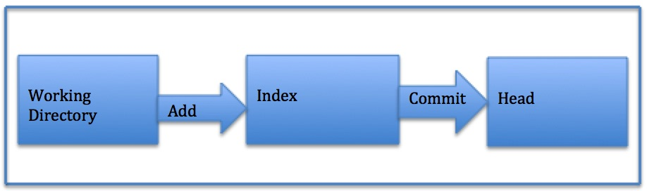
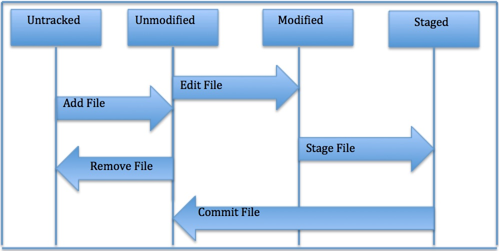

# Read 03 - Notes: Revisions and the cloud 

### Key concepts and definitions:
+ **Version control system (VCS)** - a system that allows you to revisit different versions of a file or set of files by recording changes
+ **Local VCS** - VCS on a local PC.
+ **Centralized VCS (CVCS)** - VCS on the cloud 
+ **Distributed VCS (DVCS)** - creates mirrored repos on clients. This creates a back-up for CVCS failure scenarios.
+ **Git** - a DCVS that stores data in a file system made up of *snapshots*. Supports 3 main states: *commmitted*, *modified*, *staged*.

### Steps for cloning a Git repo:
Clone existing Git repos into local PC. First set up a repo on Git using the repos set-up procedure.

1. Using terminal, navigate (using `cd`) to the directory where the repos are kept.
2. Create new directory: `git clone <URL>`
3. For existing directory: `git clone <URL> <directory name>`
+ Note: accessing GitHub repo URL: `git remote -v`

### ACP (add-commit-push) process:
1. Add file: `git add <file name>` or `git add *` (for all files)
+ Note: checking on git status: `git status`
2. Commit file: `git commit -m " <description of change>"` or `git commit -a` (for all files)
3. Push file: `git push origin main` 
+ Note: here, *origin* denotes server and *main* denotes client.

### Flow diagrams:
Following are some flow diagrams as visual aids.

Fig 1. Repository structure
#

Fig 2. File Life Cycle

Content Source: [Git Tutorial: A comprehensive guide](https://blog.udemy.com/git-tutorial-a-comprehensive-guide/#7_2)

****
[<<< Back to Main](sangmlee76.github.io/reading-notes/)