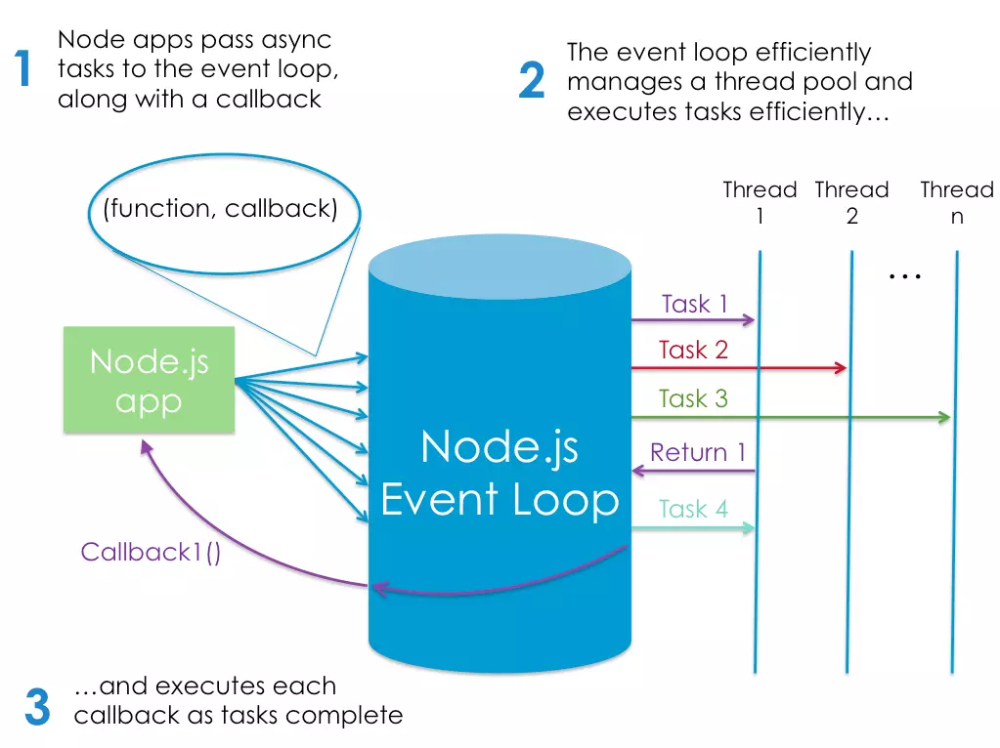

# Read 06 - Notes: Node, Express, and APIs

## [An Introduction to Node.js on sitepoint.com](https://www.sitepoint.com/an-introduction-to-node-js)

```
Node.js is an event-based, non-blocking, asynchronous I/O runtime that uses Google’s V8 JavaScript engine and libuv library.
```

+ Node.js is a program we can use to execute JavaScript on our computers. In other words, it’s a JavaScript runtime.
+ The V8 engine is the open-source JavaScript engine that runs in Google Chrome and other Chromium-based web browsers, including Brave, Opera, and Vivaldi. 
+ It was designed with performance in mind and is responsible for compiling JavaScript directly to native machine code that your computer can execute.
+ In addition to being the **package manager** for JavaScript, npm is also the world’s largest software registry. 

### What is Node.js used for?
+ If you want develop apps with any modern JavaScript framework (for example, React or Angular), you’ll be expected to have a working knowledge of Node and npm

+ Node.js is a runtime that allows server-side programs to be written in JavaScript.  This essentially means that Node.js allows running JavaScript on the server.

### So What? Why is this important?

+ Node.js execution model **(key concept)** --> it is single threaded and **event driven** (get more details on this from the [source article](https://www.sitepoint.com/an-introduction-to-node-js/)). This enables Node.js to execute asynchronously and allows handling of simultaneous connections.


Figure 1. Node's execution model (source: https://www.sitepoint.com/an-introduction-to-node-js/)

+ Code review "Hellow, World" - Server section from the [source article](https://www.sitepoint.com/an-introduction-to-node-js/)

### What types of apps are ideal for Node.js?

+ A **non-exhaustive** list:
  - Aplications that require some form of real-time interaction or collaboration (e.g. chat sites)

  - Building APIs that handle lots of requests that are I/O driven (e.g. database operations)

  - Sites involving data streaming (Node can process files as they are being uploaded)

  - Reference sites:
    + Target Node use case:  [Building a Real-time Chat App](https://www.sitepoint.com/building-real-time-chat-app-sails-js/)
    + Basic/traditional app (e.g. Node not required):  [How to Build and Structure a Node.js MVC Application](https://www.sitepoint.com/node-js-mvc-application/)

+ Even a solution such as *Express* is minimal, meaning that if you want to do anything slightly out of the ordinary, you’ll need to pull in additional modules from npm. This is in stark contrast to frameworks such as Rails or Laravel, which come with a lot of functionality out of the box.

### Node.js advantages
1. Speed and scalability
2. Common language across front & backend development
3. Understands JSON (the most important data exchange format on the web)

### Other uses of Node
1. A scripting language to automate repetitive or error prone tasks
2. Write your own command line tool
3. Build cross-platform desktop apps
4. Create your own robots


***
[<<< Back to Main](https://sangmlee76.github.io/reading-notes/)


